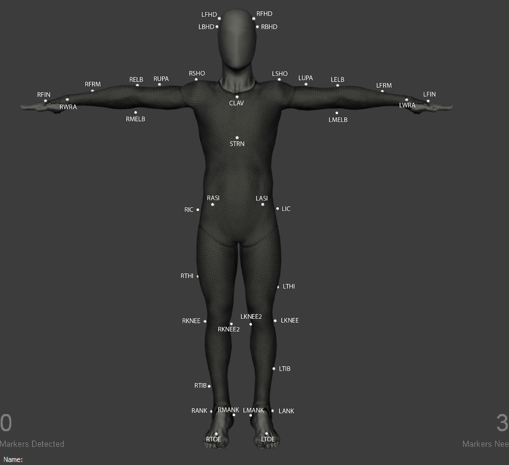
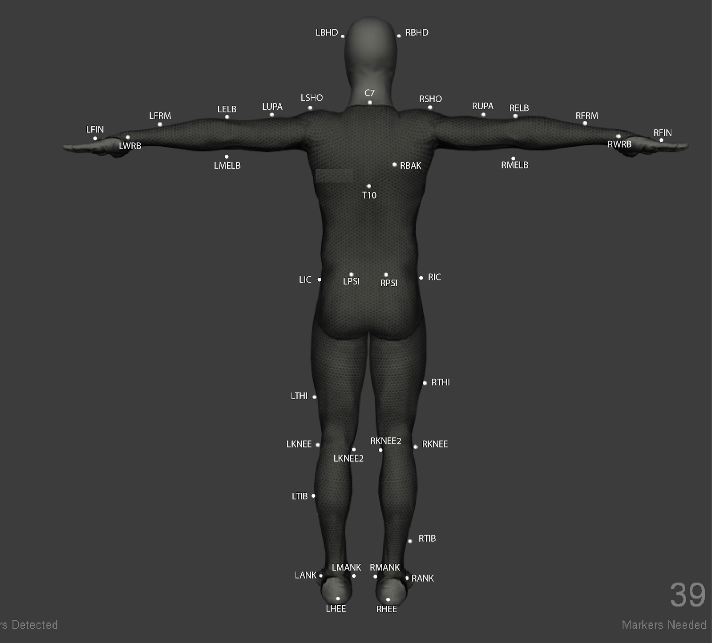
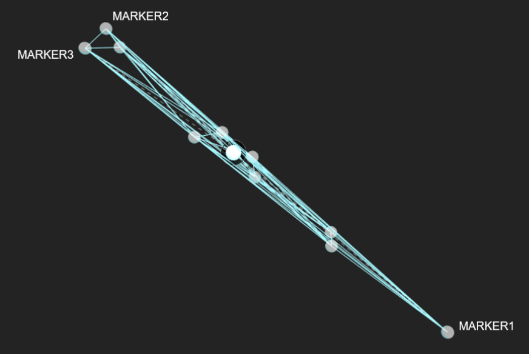
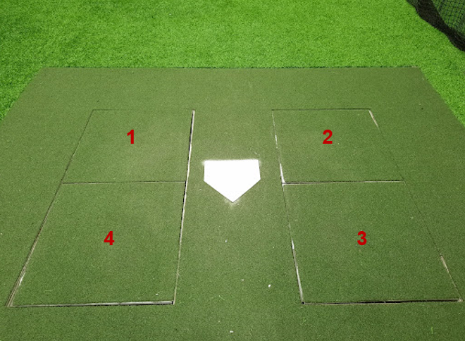
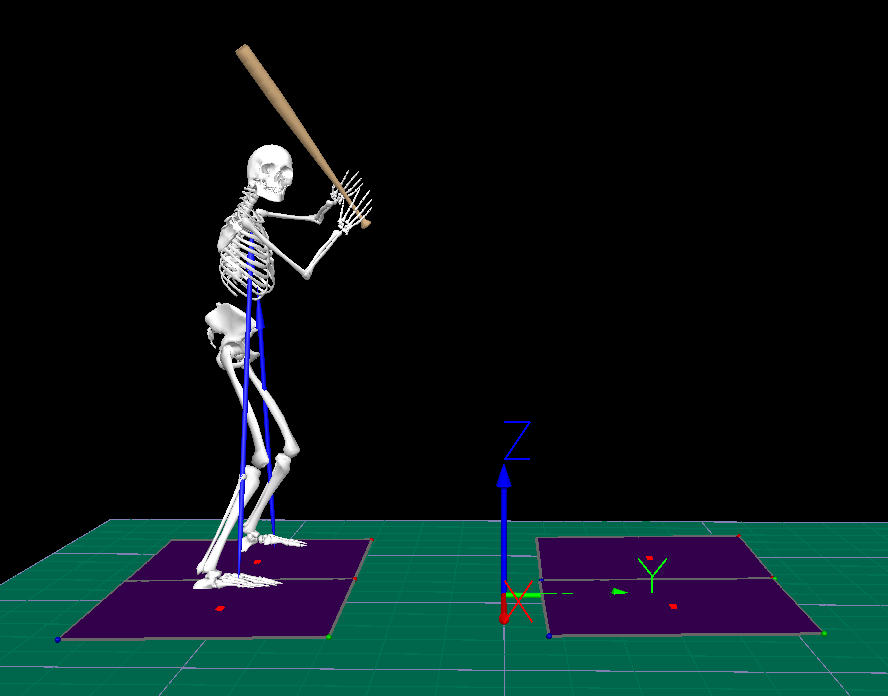
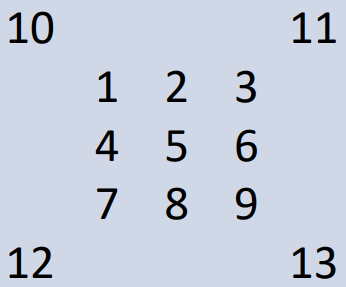
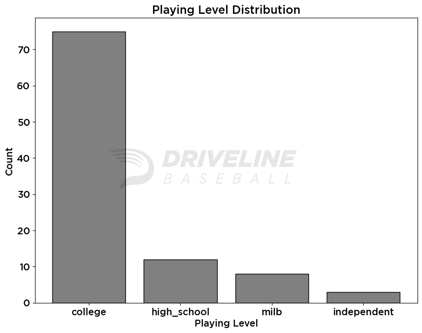
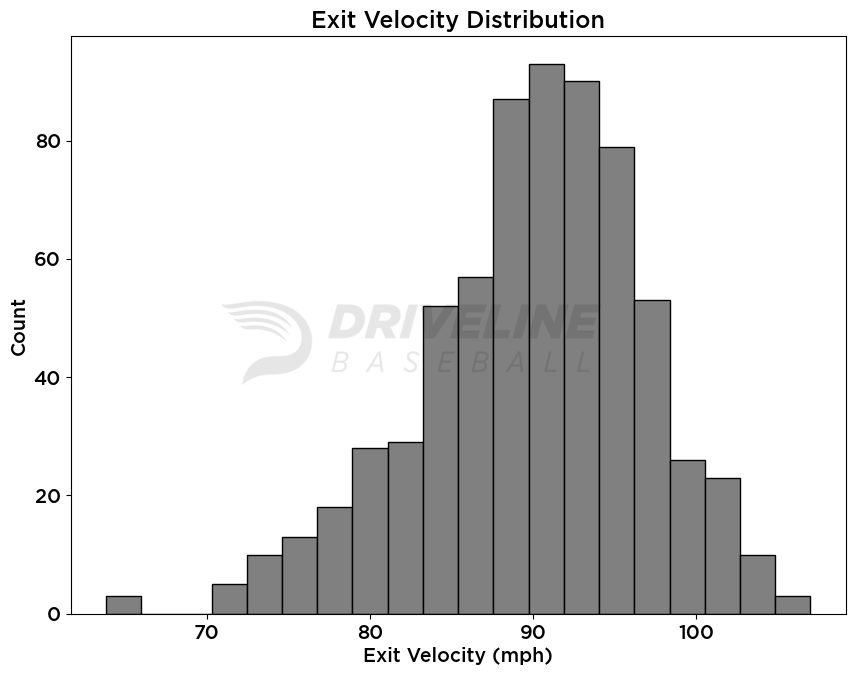

# OBP Hitting Documentation

## C3D

Cleaned C3D files are provided at `~\baseball_hitting\data\c3d` for those who wish to conduct their own analysis process from start to finish. C3Ds are separated into athlete-specific folders with static model files also provided.

### File Naming

All C3Ds follow a common naming convention.

`USERid_SESSIONid_HEIGHT_WEIGHT_SIDE_SWINGNUMBER_EXITVELOCITY.c3d`

`USERid` = unique athlete identifier

`SESSIONid` = unique session identifier

`HEIGHT` = body height in inches (body height in meters is also provided in the metadata CSV)

`WEIGHT` = bodyweight in pounds (body mass in kilograms is also provided in the metadata CSV)

`SIDE` = hitting side (L = left handed swing, R = right handed swing)

`SWINGNUMBER` = swing number from the athlete’s assessment

`EXITVELOCITY` = speed of the ball after contact in miles per hour to one decimal place (with the decimal place removed)

- ex. `~_905.c3d` would be an exit velocity of 90.5 mph; `~_950.c3d` would be an exit velocity of 95.0 mph

## Marker Set

### Front View



*NOTE: LIC and RIC (Iliac Crest markers) are no longer used and may not be present in some C3D files. Additionally, RKNEE2 and LKNEE2 are labeled as RMKNE and LMKNE respectively.*

### Back View



*NOTE: LIC and RIC (Iliac Crest markers) are no longer used and may not be present in some C3D files. Additionally, RKNEE2 and LKNEE2 are labeled as RMKNE and LMKNE respectively.*

### Bat Rigid Body

Ten markers are used to track the bat. MARKER1, MARKER2, and MARKER3 are consistent across all bats and are used to define the proximal and distal ends of the rigid body. Markers 4-10 are used for tracking and the location of these markers vary from bat to bat.



## Force Plates

Ground reaction force data were collected using four force plates embedded underneath the batter’s box turf surface (average turf thickness ~ 0.5 inches).



***NOTE: Hitters will start with one or both feet on the back force plate (#4 or #3) and land with just their lead leg on the front force plate (#1 or #2).***

## Global Coordinate System

The global (laboratory) reference frame is such that (+) x points from home plate toward the pitcher’s mound, (+) y points toward the right-handed batter’s box, and (+) z points upward



# Pitching Machine Setup

All swings were collected while hitting off of a pitching machine set at ~65 mph from ~40 ft away from home plate.


# Full Signal

We first calculate joint angles and velocities as well as bat angles and velocities according to the right hand rule. We then perform select adjustments to better match coach/player intuition (righty/lefty symmetry, sign negations, adding or subtracting 90 degrees, etc.).

Below is a list of joint and bat mechanics, their components, and conventions. Where joint kinematics are constrained by the model, corresponding kinetic conventions are provided.

## Processed Joint Kinematic/Kinetic Conventions

### Kinematics (Joint/Bat Angles, Joint/Bat Velocities)

| Joint | C1 (”_X”) | C2 (”_Y”) | C3 (”_Z”) |
| --- | --- | --- | --- |
| Wrist | Flexion (-)/Extension (+) | Ulnar (-)/Radial (+) Deviation | Constrained |
| Elbow | Flexion (+)/Extension (-) | Constrained | Pronation (+)/Supination (-) |
| Shoulder | Horizontal Ab (+)/Adduction (-) | Ab (+)/Adduction (-) | External (+)/Internal (-) Rotation |
| Pelvis | Posterior (+)/Anterior (-) Tilt | Lateral Tilt Toward (+)/Away From Rear Leg | Axial Rotation Toward (+)/Away (-) From Mound |
| Torso | Extension (+)/Flexion (-) | Lateral Tilt Toward (+)/Away From Rear Leg | Axial Rotation Toward (+)/Away (-) From Mound |
| Torso-Pelvis | Extension (+)/Flexion (-) | Lateral Tilt Toward (+)/Away From Rear Leg | Torso Rotated Toward Mound; Pelvis Rotated Toward Catcher (+)/Torso Rotated Toward Catcher; Pelvis Rotated Toward Mound (-) |
| Hip | Flexion (+)/Extension (-) | Ab (+)/Adduction (-) | Internal (+)/External (-) Rotation |
| Knee | Flexion (+)/Extension (-) | Constrained | Constrained |
| Ankle | Dorsi (+)/Plantar (-) Flexion | Eversion (+)/Inversion (-) | Lateral (+)/Medial (-) Rotation |
| Bat | Bat Rotation Around Spine Toward (+)/Away (-) From Mound | Bat End Pointing Upward (+)/Downward (-) | Axial Rotation: Left Handed Swings - Rotation Toward (+)/Away (-) From Mound | Right Handed Swings - Rotation Toward (+)/Away (-) From Mounds |
| Bat-Torso | NA | Barrel Moving Upward (+)/Downward (-) Relative to Torso | NA |
| Attack Angle | Sweet Spot of Bat Moving Upward (+)/Downward (-) | NA | NA |

### Processed Ground Reaction Force Conventions

Ground reaction force data were filtered with a 4th order Butterworth low pass filter with a cutoff frequency of 40.0 Hz

| Force Plate | X | Y | Z |
| --- | --- | --- | --- |
| All | + = Toward Pitcher | + = Posterior  | + = Superior |

### Table Schema

Full signal data are broken up into four large CSV files:

- `force_plate`: rear leg, lead leg ground reaction forces
- `joint angles`: joint angles
- `joint_velos`: joint angular velocities
- `landmarks`: joint center positions

Tables may be joined using `session_swing` + `time`. Please note that force plate and marker-derived data are provided at their own respective measurement rates (360 Hz and 1,080 Hz, 
respectively). Therefore, we recommend caution when joining force plate and marker-derived data to avoid potential data loss.

The times at which common events occurred are also joined in each table for convenience. Provided events are front foot contact (10% bodyweight), front foot plant (100% bodyweight), and contact.

One potential research project is to process the provided C3D using your own pipeline and compare your results with ours. Self-processed data from C3D files may be linked to the provided full signal data through the metadata CSV located at `~\baseball_hitting\data\metadata.csv`.

# Point of Interest

Kinematic metrics commonly referenced in biomechanical analyses are arranged into a point-of-interest (POI) CSV at `~\data\poi\POI.csv`. We attempted to name variables so their definitions would be clear, however, this may not always be the case.

```python
'session_swing' : unique swing ID
'session' : unique session ID
'exit_velo_mph_x' : exit velocity (miles per hour)
'blast_bat_speed_mph_x' : bat speed at contact as measured by Blast Motion sensor (miles per hour)
'bat_speed_mph_contact_x' : resultant bat speed at contact event (miles per hour)
'sweet_spot_velo_mph_contact_x' : x component (toward mound) of sweet spot velocity vector at contact (miles per hour)
'sweet_spot_velo_mph_contact_y': y component (toward pull-side) of sweet spot velocity vector at contact (miles per hour)
'sweet_spot_velo_mph_contact_z' : z component (upward) of sweet spot velocity vector at contact (miles per hour)
'bat_torso_angle_connection_x' : bat-torso angle at down swing event - this is the same as bat_torso_angle_ds and is what Blast Motion calls “Early Connection” (deg)
'attack_angle_contact_x': vertical attack angle at contact (deg)
'bat_speed_mph_max_x': maximum resultant bat speed (miles per hour)
'bat_speed_xy_max_x' : maximum resultant angular velocity of the bat - just x and y components (deg/sec) 
'bat_torso_angle_ds_y' : vertical bat angle relative to the torso at down swing event - this is the same as bat_torso_angle_connection and is what Blast calls “Early Connection” (deg)
'hand_speed_blast_bat_mph_max_x' : maximum hand speed in mph - calculated the same way as Blast’s hand speed (deg/sec) 
'hand_speed_mag_max_x' : maximum resultant hand speed between first move and contact (deg/sec) 
'pelvis_angle_fm_x': pelvis angle (x) at first move - ussing K-Vest conventions (deg)
'pelvis_angle_fm_y': pelvis angle (y) at first move - ussing K-Vest conventions (deg)
'pelvis_angle_fm_z': pelvis angle (z) at first move - ussing K-Vest conventions (deg)
'pelvis_angle_fp_x' : pelvis angle (x) at foot plant - using K-Vest conventions (deg)
'pelvis_angle_fp_y' : pelvis angle (y) at foot plant - using K-Vest conventions (deg)
'pelvis_angle_fp_z' : pelvis angle (z) at foot plant - using K-Vest conventions (deg)
'pelvis_angle_hs_x' : pelvis angle (x) at heel strike - using K-Vest conventions (deg)
'pelvis_angle_hs_y' : pelvis angle (y) at heel strike - using K-Vest conventions (deg)
'pelvis_angle_hs_z' : pelvis angle (z) at heel strike - using K-Vest conventions (deg)
'torso_angle_fm_x' : torso angle (x) at first move - using K-Vest conventions (deg)
'torso_angle_fm_y': torso angle (y) at first move - using K-Vest conventions (deg)
'torso_angle_fm_z' : torso angle (z) at first move - using K-Vest conventions (deg)
'torso_angle_fp_x' : torso angle (x) at foot plant - using K-Vest conventions (deg)
'torso_angle_fp_y' : torso angle (y) at foot plant - using K-Vest conventions (deg)
'torso_angle_fp_z' : torso angle (z) at foot plant - using K-Vest conventions (deg)
'torso_angle_hs_x' : torso angle (x) at heel strike - using K-Vest conventions (deg)
'torso_angle_hs_y' : torso angle (y) at heel strike - using K-Vest conventions (deg)
'torso_angle_hs_z' : torso angle (z) at heel strike - using K-Vest conventions (deg)
'upper_arm_speed_mag_max_x' : maximum resultant upper arm speed between first move and contact (deg/sec) 
'x_factor_fm_x' : x-factor angle (x) at first move (same as torso-pelvis angle) - using K-Vest conventions (deg)
'x_factor_fm_y' : x-factor angle (y) at first move (same as torso-pelvis angle) - using K-Vest conventions (deg)
'x_factor_fm_z' : x-factor angle (z) at first move (same as torso-pelvis angle) - using K-Vest conventions (deg)
'x_factor_fp_x' : x-factor angle (x) at foot plant (same as torso-pelvis angle) - using K-Vest conventions (deg)
'x_factor_fp_y' : x-factor angle (y) at foot plant (same as torso-pelvis angle) - using K-Vest conventions (deg)
'x_factor_fp_z' : x-factor angle (z) at foot plant (same as torso-pelvis angle) - using K-Vest conventions (deg)
'bat_max_x' : maximum bat angular velocity relative to the lab - used for tagging handedness (deg/sec) 
'bat_min_x' : minimum bat angular velocity relative to the lab - used for tagging handedness (deg/sec) 
'hand_speed_mag_fm_x' : resultant hand speed at first move (deg/sec) 
'hand_speed_mag_fp_x': resultant hand speed at foot plant (deg/sec) 
'hand_speed_mag_maxhss_x' : resultant hand speed at maximum hip-shoulder separation (deg/sec) 
'hand_speed_mag_seq_max_x' : maximum resultant hand speed between first move and contact (deg/sec) 
'hand_speed_mag_stride_max_velo_x' : maximum resultant hand speed between load and foot plant (deg/sec) 
'hand_speed_mag_swing_max_velo_x' : maximum resultant hand speed between load and contact (deg/sec) 
'lead_knee_launchpos_x' : lead knee angle (x) at foot plant (deg)
'lead_knee_stride_max_x' : maximum knee angle (x) between load and foot plant (deg)
'lead_knee_stride_max_y' : maximum knee angle (y) between load and foot plant (deg)
'lead_knee_stride_max_z' : maximum knee angle (z) between load and foot plant (deg)
'lead_wrist_fm_x' : lead wrist angle (x) at first move (deg)
'lead_wrist_swing_max_x' : maximum lead wrist angle (x) between load and contact (deg)
'pelvis_angular_velocity_fm_x' : pelvis angular velocity at first move (deg/sec) 
'pelvis_angular_velocity_fp_x': pelvis angular velocity at foot plant (deg/sec) 
'pelvis_angular_velocity_maxhss_x': pelvis angular velocity at maximum hip-shoulder separation (deg/sec) 
'pelvis_angular_velocity_seq_max_x' : maximum pelvis angular velocity between first move and contact (deg/sec) 
'pelvis_angular_velocity_stride_max_x' : maximum pelvis angular velocity between load and foot plant (deg/sec) 
'pelvis_angular_velocity_swing_max_x' : maximum pelvis angular velocity between load and contact (deg/sec) 
'pelvis_fm_x' : pelvis angle (x) at first move (deg)
'pelvis_fm_y' : pelvis angle (y) at first move (deg)
'pelvis_fm_z' : pelvis angle (z) at first move (deg)
'pelvis_launchpos_x' : pelvis angle (x) at foot plant (deg)
'pelvis_launchpos_y' : pelvis angle (y) at foot plant (deg)
'pelvis_launchpos_z' : pelvis angle (z) at foot plant (deg)
'pelvis_loadedpos_x' : pelvis angle (z) at loaded position (deg)
'pelvis_load_max_x' : maximum pelvis angle (z) between the start of the take and the loaded position (deg)
'pelvis_stride_max_x' : maximum pelvis angle (x) between the load and foot plant (deg)
'pelvis_stride_max_y' : maximum pelvis angle (y) between the load and foot plant (deg)
'pelvis_stride_max_z' : maximum pelvis angle (z) between the load and foot plant (deg)
'pelvis_swing_max_x' : maximum pelvis angle (x) between the load and contact (deg)
'pelvis_swing_max_y' : maximum pelvis angle (y) between the load and contact (deg)
'pelvis_swing_max_z' : maximum pelvis angle (z) between the load and contact (deg)
'rear_elbow_fm_x' : rear elbow angle (x) at first move (deg)
'rear_elbow_fm_z' : rear elbow angle (z) at first move - wrist pronation/supination (deg)
'rear_elbow_launchpos_x' : rear elbow angle (x) at foot plant (deg)
'rear_elbow_stride_max_x' : maximum rear elbow angle (x) between the load and foot plant (deg)
'rear_elbow_stride_max_z' : maximum rear elbow angle (z) between the load and foot plant - wrist pronation/supination (deg)
'rear_elbow_swing_max_x' : maximum rear elbow angle (x) between the load and contact (deg)
'rear_elbow_swing_max_z' : maximum rear elbow angle (z) between the load and contact - wrist pronation/supination (deg)
'rear_hip_launchpos_x' : rear hip angle (x) at foot plant (deg)
'rear_hip_stride_max_x' : maximum hip angle (x) between the load and foot plant (deg)
'rear_hip_stride_max_y' : maximum hip angle (y) between the load and foot plant (deg)
'rear_hip_stride_max_z' : maximum hip angle (z) between the load and foot plant (deg)
'rear_shoulder_launchpos_x' : rear shoulder angle (y) at foot plant (deg)
'rear_shoulder_stride_max_x' : maximum rear shoulder angle (x) between the load and foot plant (deg)
'rear_shoulder_stride_max_y' : maximum rear shoulder angle (y) between the load and foot plant (deg)
'rear_shoulder_stride_max_z' : maximum rear shoulder angle (z) between the load and foot plant (deg)
'torso_angular_velocity_fm_x' : torso angular velocity at first move (deg/sec) 
'torso_angular_velocity_fp_x' : torso angular velocity at foot plant (deg/sec) 
'torso_angular_velocity_maxhss_x' : torso angular velocity at maximum hip-shoulder separation (deg/sec) 
'torso_angular_velocity_seq_max_x' : maximum torso angular velocity between first move and contact (deg/sec) 
'torso_angular_velocity_stride_max_x' : maximum torso angular velocity between the load and foot plant (deg/sec) 
'torso_angular_velocity_swing_max_x' : maximum torso angular velocity between the load and contact (deg/sec) 
'torso_fm_x' : torso angle (x) at first move (deg)
'torso_fm_y' : torso angle (y) at first move (deg)
'torso_fm_z' : torso angle (z) at first move (deg)
'torso_launchpos_x' : torso angle (x) at foot plant (deg)
'torso_launchpos_y' : torso angle (y) at foot plant (deg)
'torso_launchpos_z' : torso angle (z) at foot plant (deg)
'torso_loadedpos_x' : Torso angle (z) at loaded position (deg)
'torso_load_max_x' : maximum torso angle (z) between the start of the take and the load (deg)
'torso_pelvis_fm_x' : torso-pelvis angle (z) at first move (deg)
'torso_pelvis_launchpos_x' : torso-pelvis angle (z) at foot plant (deg)
'torso_pelvis_loadedpos_x' : Torso-pelvis angle (z) at loaded position (deg)
'torso_pelvis_load_max_x' : maximum torso-pelvis angle (z) between the start of the take and the load (deg)
'torso_pelvis_stride_max_x' : maximum torso-pelvis angle (x) between the load and foot plant (deg)
'torso_pelvis_stride_max_y' : maximum torso-pelvis angle (y) between the load and foot plant (deg)
'torso_pelvis_stride_max_z' : maximum torso-pelvis angle (z) between the load and foot plant (deg)
'torso_pelvis_swing_max_x' : maximum torso_pelvis angle (z) between the load and contact (deg)
'torso_stride_max_x' : maximum torso angle (x) between the load and foot plant (deg)
'torso_stride_max_y' : maximum torso angle (y) between the load and foot plant (deg)
'torso_stride_max_z' : maximum torso angle (z) between the load and foot plant (deg)
'torso_swing_max_x' : maximum torso angle (x) between the load and contact (deg)
'torso_swing_max_y' : maximum torso angle (y) between the load and contact (deg)
'torso_swing_max_z' : maximum torso angle (z) between the load and contact (deg)
'upper_arm_speed_mag_fm_x' : resultant upper arm speed at first move (deg/sec) 
'upper_arm_speed_mag_fp_x' : resultant upper arm speed at foot plant (deg/sec) 
'upper_arm_speed_mag_maxhss_x' : resultant upper arm speed at maximum hip-shoulder separation (deg/sec) 
'upper_arm_speed_mag_seq_max_x' : maximum resultant upper arm speed between first move and contact (deg/sec) 
'upper_arm_speed_mag_stride_max_velo_x' : maximum resultant upper arm speed between the load and foot plant (deg/sec) 
'upper_arm_speed_mag_swing_max_velo_x' : maximum resultant upper arm speed between the load and contact (deg/sec) 
'x_factor_hs_x' : x-factor angle (x) at heel strike (same as torso-pelvis angle) - using K-Vest conventions (deg)
'x_factor_hs_y' : x-factor angle (y) at heel strike (same as torso-pelvis angle) - using K-Vest conventions (deg)
'x_factor_hs_z' : x-factor angle (z) at heel strike (same as torso-pelvis angle) - using K-Vest conventions (deg)
'max_cog_velo_x' : maximum center of gravity velocity from start of take to end of take (meters per second)
```
In addition to biomechanical POI metrics, we also provide pitch level HitTrax data in `~\data\poi\hittrax.csv`. Those familiar with exporting raw HitTrax data should recognize most of the columns.

```python
'session_swing': unique swing identifier
'pitch': velocity of incoming pitch (from machine) (mph)
'strike_zone': strike zone region of pitch
'la': launch angle (deg)
'dist': carry distance (ft)
'res': predicted result of ball in play
'bearing': spray angle (deg) (0 = straight back at pitcher; + = lefty pull field, - = righty pull field)
'vertical_distance': distance from center of strike zone (inches) (+ values = higher than middle of strike zone)
'horizontal_distance': distance from center of strike zone (inches) (+ values = pitches inside to right handed batter)
'poi_x': horizontal point of impact coordinate (0 = back tip of home plate; + = inside to left handed batter)
'poi_y': vertical point of impact coordinate (0 = ground; + = above ground)
'poi_z': point of impact coordinate (0 = back tip of home plate; + values = towards pitcher)
'pitch_angle': decent angle of incoming pitch (deg)
```

HitTrax strike zone zones are as follows:



***HitTrax Zones from the pitcher's perspective***

# About the Data

## Playing Level Distribution

Most participants played at the collegiate level at the time of data collection.



## Exit Velocity Distribution


